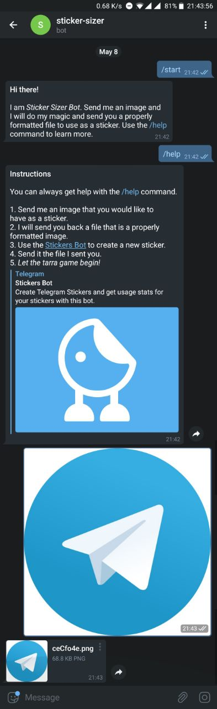

**Note:** Archived due to image manipulation library being deprecated

# Sticker sizer bot for Telegram

Telegram bot that sizes images so that they can be used as stickers. Add [StickerSizerBot](https://t.me/StickerSizerBot) on Telegram and start using it :)

This project was built for the [Junction May Online challenge](https://www.reddit.com/r/JunctionCommunity/comments/bld5f1/may_online_challenge_life_hack/). The task of the challenge was to hack your everyday life. And if you are a sticker lover on Telegram, you will love this.

## Motivation

Telegram stickers are awesome! They offer you the chance to express your feelings and reactions. They spice up the conversation nicely :)

But the sticker creation can be a bit bothersome, at least on mobile. Say, you see a meme or something on Facebook, Reddit etc. and you think: "Hey! It would be awesome to have that as a sticker!" You download the image, open Telegram, start chatting with @Stickers and send your amazing sticker idea to the bot.

> Sorry, the file type is invalid. Please convert your image to PNG.

"Okay, no problem. Just reformat it to PNG."

> Sorry, the image dimensions are invalid. Please check that the image fits into a 512x512 square (one of the sides should be 512px and the other 512px or less).

"Oh sh\*t, whatever, I'll make it when I'm on the computer" And you never saw your idea turn into a sticker.

[StickerSizerBot](https://t.me/StickerSizerBot) makes this step of sticker creation easy and fun. Send your image to the bot and it will do it's magic by resizing and formatting it correctly. Now you only need to come up with good ideas! :)

## Screenshots

## Built with

- [NodeJS](https://nodejs.org/en/) - JavaScript Runtime
- [Telegraf](https://github.com/telegraf/telegraf) - Modern Telegram Bot Framework for Node.js
- [Lipo](https://github.com/lipojs/lipo) - Free image manipulation API service built on top of Sharp
- [Imgur](https://apidocs.imgur.com/) - The magic of the Internet

## Features

Send the bot an image file and it sends you back a file with a longest side of 512px. And it formats it to a PNG. Exactly what the [Stickers](https://t.me/Stickers) bot needs :)

## Installation

### Prerequisites

First you need to install [Node](https://nodejs.org/en/). In order to run the development environment you need to have an account on [Netlify](https://www.netlify.com/) and install the CLI tool: `npm install -g netlify-cli`

You also need to sign up on [Imgur](https://imgur.com/) and create a new application in order to retrieve a client id that is used to make API calls.

### Clone the repo

`git clone https://github.com/rennehir/sticker-sizer-bot.git`

### Initialize a new Netlify project

`netlify init`

Choose to create a new project. You might need to login the first time.

### Set environment variables

`netlify open`

The above command should open your project in the browser. Then navigate to Deploys –> Deploy settings –> Environment

Add two env variables, BOT_TOKEN and IMGUR_CLIENT_ID. You can retrieve a bot token from [BotFather](https://t.me/BotFather) and the Imgur client ID from your Imgur dashboard after you have created an application.

### Install dependencies

`yarn`

### Run the dev environment

`netlify run --live`

### Set webhooks

In order to make the bot respond to your messages, you need set a webhook. You can do it by visiting following URL:

`https://api.telegram.org/bot<BOT_TOKEN>/setWebhook?url=<NETLIFY-LIVE-URL>/.netlify/functions/bot`

Remember to replace the placeholders. You can find the Netlify live URL from your terminal.

### Try the bot

Now everything should be working.

## Contribute

You are more than welcome to contribute in any way. Submit an issue if something doesn't work. If you want to fix something or enhance the bot, please make a pull request :)

## License

This project is licensed under the [MIT license](https://raw.githubusercontent.com/rennehir/sticker-sizer-bot/master/LICENSE.md).

MIT © Renne Hirsimäki
